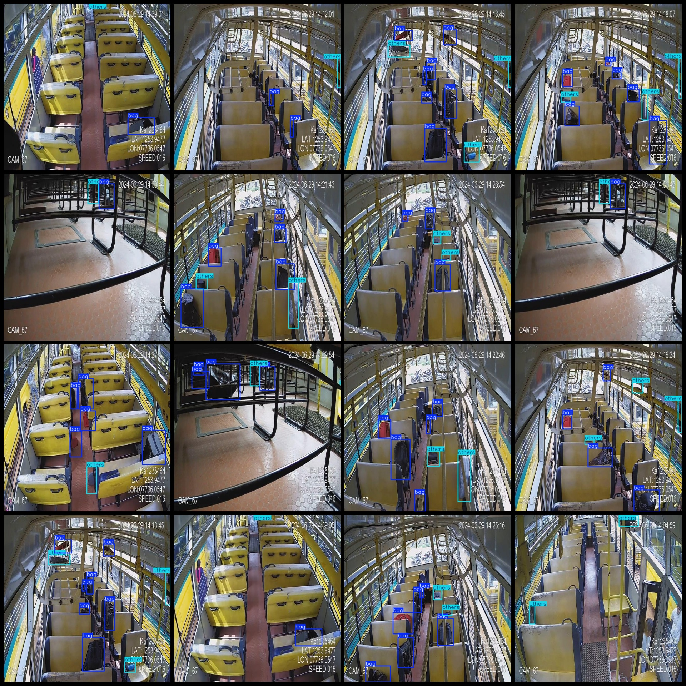
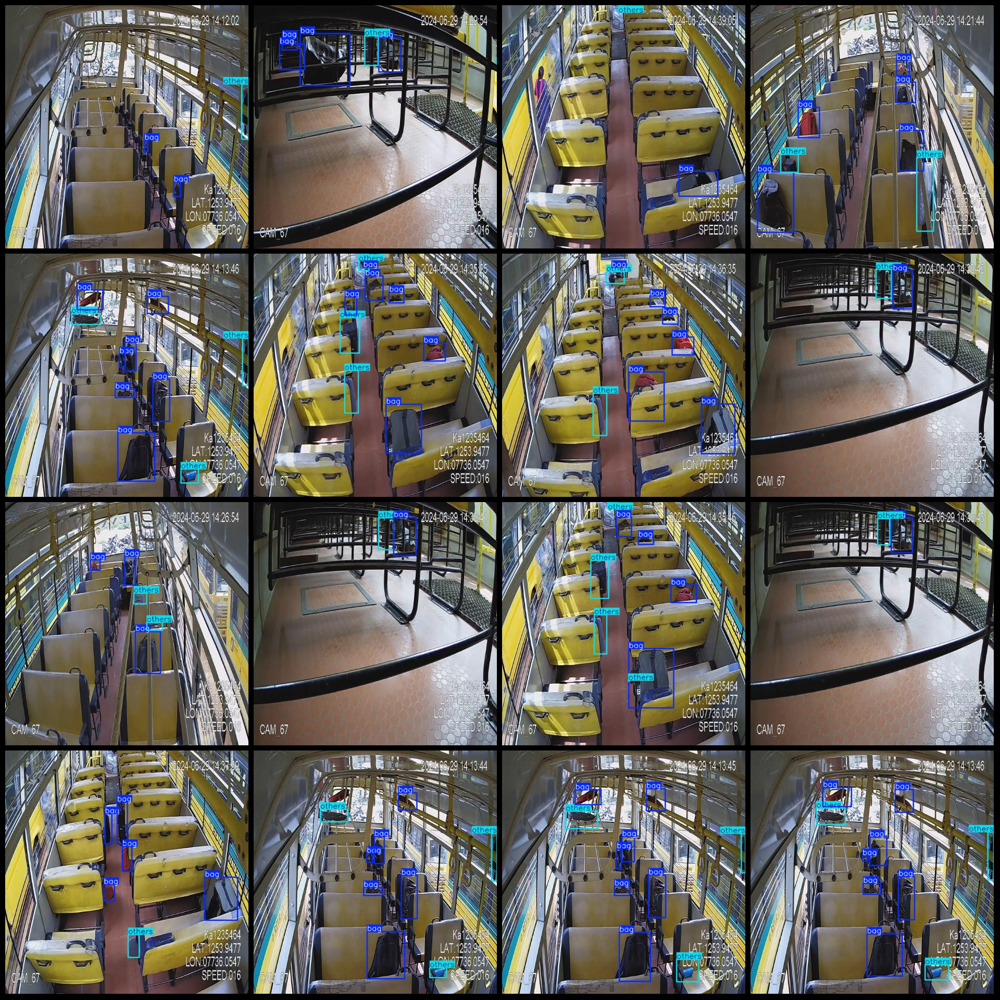

# Bus Vehicle Inspection Data Set - VOC+YOLO Format with 867 Images in 2 Categories

Dataset format: Pascal VOC format+YOLO format (without split path in txtfile, only containing jpgimage and corresponding VOC format xmlfile and yolo format txtfile)
number of images: 867  
annotation count: 867  
annotation count: 867  
annotationnumber of classes: 2  
Annotation class names in the YOLO format are listed in a file named "classes.txt". The file should be located in the "labels/" directory. The classes are listed as follows: ["bag", "others"].
boxes per class:   
bag box count = 3518  
others box count = 1736  
total boxes: 5254  
image resolution: 640x640  
Using the annotation tool: labelImg
Annotation rules: Drawing a rectangle around the class
Important notes: The dataset does not have a separate training, validation, and test set. You need to manually split it.
Special statement: This dataset does not guarantee any accuracy in the trained model or the weight file.
Image preview:
Annotation example:
## Images

Here is a pay link on Stripe ( https://buy.stripe.com/3cs8yP7sY87d0vu9AB ). Please contact me lonlonago@foxmail.com after funding $89, and I will send you a complete data files , thank you!

